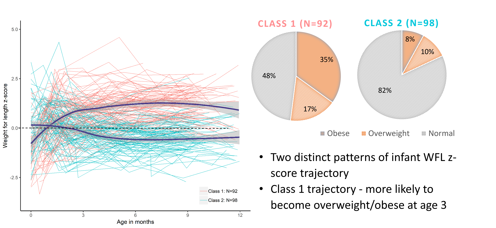

<!--more-->
Identified heterogenous weight-for-length trajectories using latent growth mixture modelling in Latinx children. Developed models to predict future obesity risk based on the growth trajectories.
 

 

This work has been presented in *Pediatric Academic Societies Meeting* (Baltimore, Maryland, April 2019) 
 