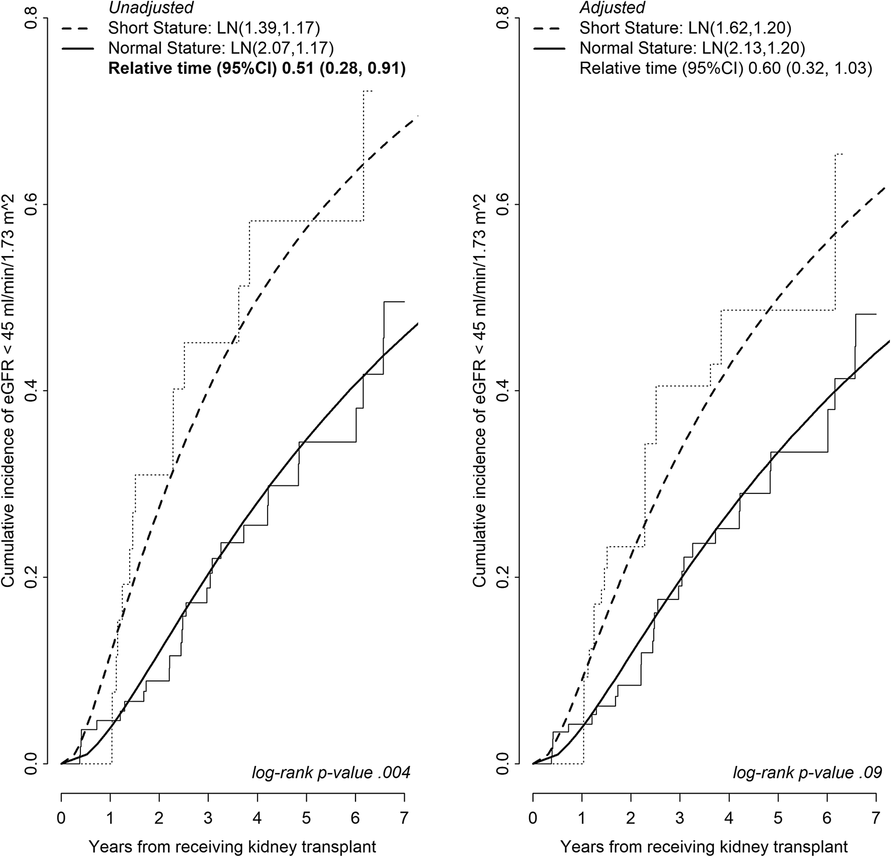

<!--more-->
Led an analysis in a cohort of children with chronic kidney disease and found that short stature was associated with faster time to reduced kidney function (eGFR < 45 ml/min/1.73 m2) after kidney transplantation. 
- Performed non-parametric survival analysis (log-rank test) and model the cumulative incidence using parametric survival models (conventional log-normal distribution).
- Propensity score weighting was used to account for potential confounding.\
  

  
This work has been published.
  **Li, Y**, Greenbaum, LA, Warady, BA, et al. “Short stature in advanced pediatric CKD is associated with faster time to reduced kidney function after transplant.” _Pediatric Nephrology 34_ (2019): 897-905. PMID: 30627858 [article](https://link.springer.com/article/10.1007/s00467-018-4165-2])