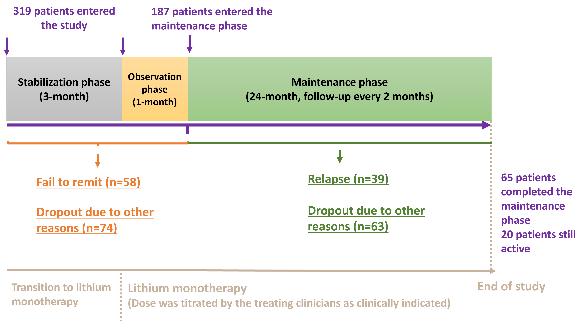
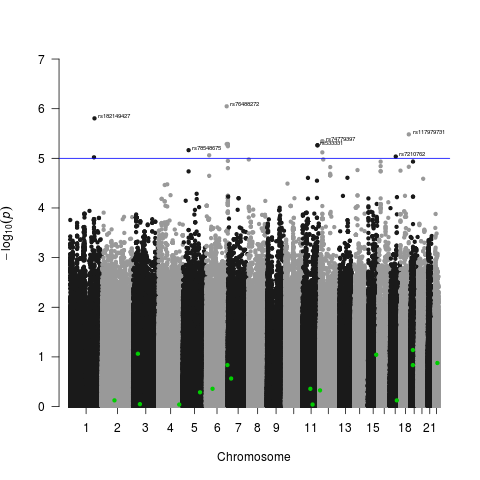

<!--more-->
Utilized genetic data to predict the response to lithium monotherapy in bipolar patients for the Pharmacogenomics of Bipolar Disorder (PGBD) Study.
 

 
- Performed genome-wide association studies (GWAS) in a survival analysis framework by implementing the (SPACox)[https://github.com/WenjianBI/SPACox] model.
 

 
- Calculated polygenetic risk scores (PRS) using multiple approaches (e.g., P+T, PRS-CS, LDpred) and built prediction models based on the PRSs to predict response to lithium monotherapy (outcome: time to fail to remit or relapse).