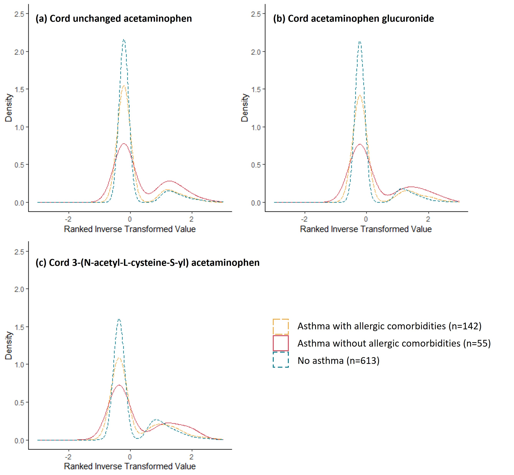

<!--more-->
Led an analysis to investigate the associations between acetaminophen metabolites in cord blood and subtypes of childhood asthma. In a birth cohort of 810 children, we found that detection of acetaminophen metabolites in cord blood was associated with an increased risk of childhood asthma *without* allergic condition, but was not associated with childhood asthma *with* allergic conditions.

This work resulted in a first-authored manuscript currently under reviewed by *Annals of Allergy, Asthma & Immunology*.