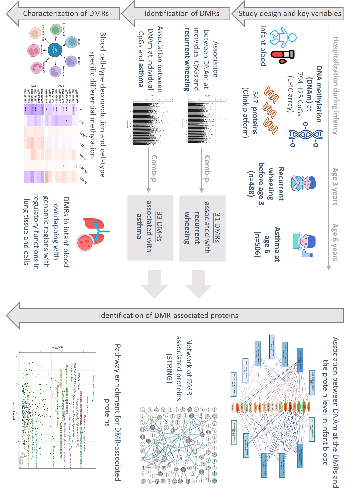

<!--more-->
Led an <u>epigenome-wide association study (EWAS)</u> to investigate the associations between infant blood DNA methylation and later outcomes of recurrent wheezing and childhood asthma in a multi-center clinical cohort of infants hospitalized for bronchiolitis.
- Identified 61 <u>novel differentially methylated regions (DMRs)</u> associated with recurrent wheezing or asthma, considering the potential <u>interaction effects from rhinovirus infection</u>.
- Conducted <u>deconvolution to identify cell-type specific effects</u> underlying the DMRs; replicated the findings in isolated eosinophils. 
- Explored <u>molecular network between the DMRs and 364 inflammatory and immune-related proteins</u> to improve the understanding of the mechanisms underlying asthma development.
- Leveraged external resources, including <u>UK biobank, STRING, ENCODE, Roadmap Epigenomics, and CATlas,</u> to further improve the interpretation of the findings.
- Designed and executed data quality control pipelines for Illumina methylation arrays data and Olink proteomics data.
 

 
This work has been presented at the *American Society for Human Genetics (ASHG) 2023 Annual Meeting* (Washington DC, November 2023). A first-authored manuscript is currently in preparation. 