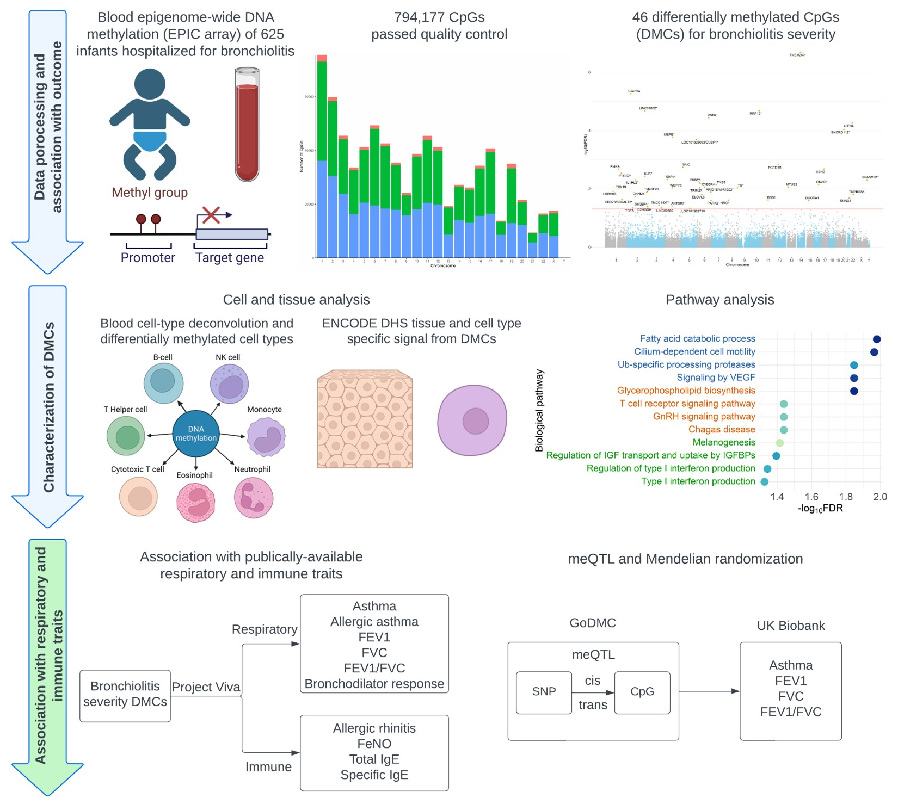

<!--more-->
Conducted data quality control and data analysis for and epigenome-wide association study to identify DNA methylation signatures related to infant bronchiolitis severity. 

This work has been published recently.
Zhu, Z, **Li, Y**, Freishtat, RJ, et al. “Epigenome-wide association analysis of infant bronchiolitis severity: a multicenter prospective cohort study.” _Nature Communications_ 14.1 (2023): 5495. PMID: 37679381 [https://www.nature.com/articles/s41467-023-41300-y]