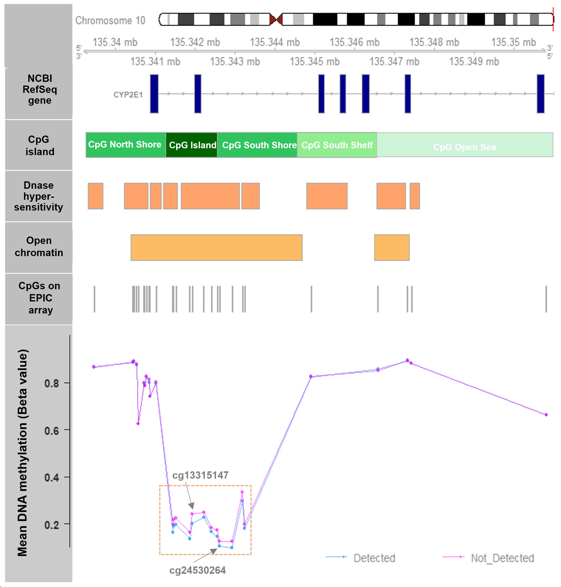

<!--more-->
Led an analysis to discover the associations between acetaminophen metabolites (measured by liquid chromatography-mass spectrometry, LC-MS) in cord blood and lower DNA methylation level at the promoter region of *CYP2E1* in a US birth cohort. The findings suggest that DNA methylation of *CYP2E1* may be an important regulator of the potential effects of maternal acetaminophen use on newborns. 
 

 
This work has been published recently. 
**Li, Y**, Hong, X, Liang, L, et al. “Association between acetaminophen metabolites and _CYP2E1_ DNA methylation level in neonate cord blood in the Boston Birth Cohort.” _Clinical Epigenetics_ 15.1 (2023): 132. [PMID: 37596607](https://link.springer.com/article/10.1186/s13148-023-01551-4)
