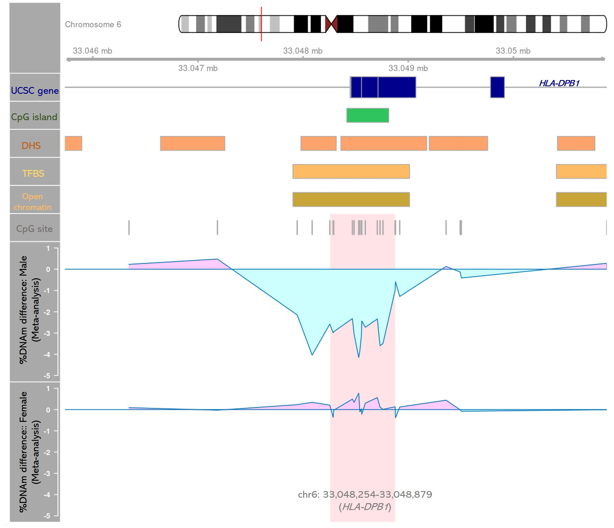

<!--more-->
Led an EWAS meta-analysis to evaluate the associations between DNA methylation at birth and childhood asthma in a diverse population.
- Analyzed data from 5 pediatric cohorts (n=1212) in the Environmental influences on Child Health Outcomes [(ECHO) Program](https://echochildren.org/).
- Identified methylation differences associated with asthma including novel differentially methylated regions in the human leukocyte antigens (HLA) regions.
 

 
- Investigated the heterogenous effects of DNA methylation on childhood asthma between male and female.
- The first study to investigate epigenome-wide differential DNA methylation associated with childhood asthma among infants who were born before 28 weeks of gestation (i.e., extremely preterm).
 

This work resulted in a first-authored manuscript currently under review by *Journal of Allergy and Clinical Immunology*