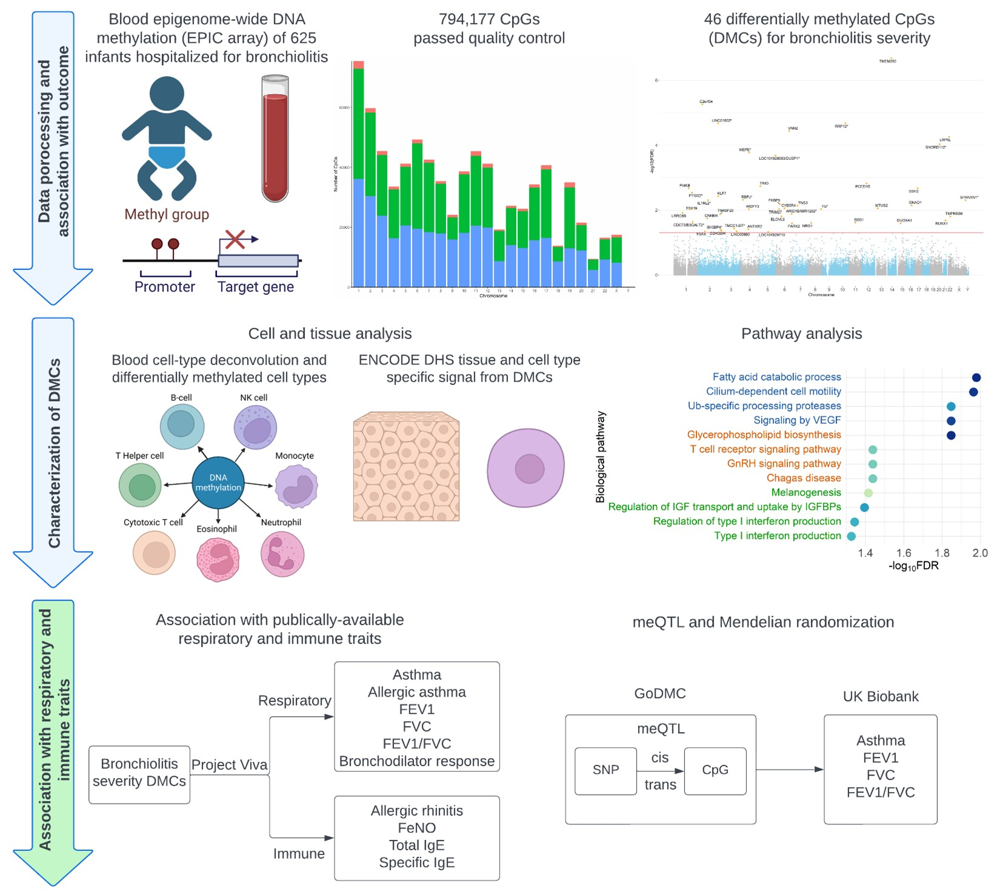

<!--more-->
Conducted data quality control and data analysis for and epigenome-wide association study to identify DNA methylation signatures related to infant bronchiolitis severity. 

In this study, we identified 33 differentially methylated CpG sites in infant blood that are associated with bronchiolitis severity in 625 infants hospitalized for bronchiolitis. These CpG sites were enriched in relevant tissues (e.g., lung), cells (e.g., small airway epithelium cells), and biological pathways (e.g., IL-1 signaling). We conducted Mendelian randomization analysis using cis-meQTLs as genetic instruments, and found that DNA methylation at 4 CpG sites associated with bronchiolitis severity likely had causal effects on later asthma and/or lung function. 
 

 
This work has been published recently.  
Zhu, Z, **Li, Y**, Freishtat, RJ, et al. “Epigenome-wide association analysis of infant bronchiolitis severity: a multicenter prospective cohort study.” _Nature Communications_ 14.1 (2023): 5495. PMID: 37679381 [article](https://www.nature.com/articles/s41467-023-41300-y)