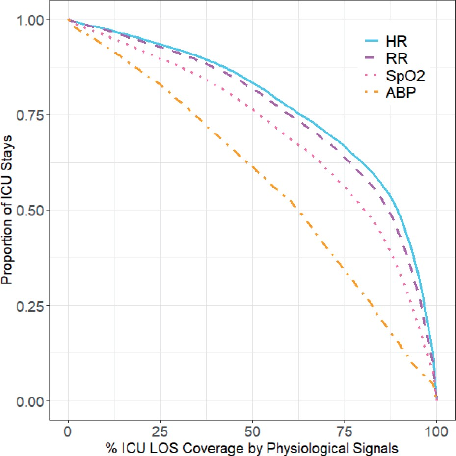

<!--more-->
Conducted data analysis to evaluate the quality of time series physiologic signals in a large-scale ICU database. 
- Evaluated the completeness, accuracy, and timeliness of minute-by-minute time series vital signs data, including heart rate, respiratory rate, blood oxygen saturation, and arterial blood pressure, captured from 16,009 patients-ICU stays and corresponding to 9410 unique adult patients.
- This study has paved the way for the future development of predictive models for ICU outcomes utilizing this extensive database.
 

*Percentage of ICU length of stays covered by acceptable vital sign data versus proportion of ICU stays.*
 

This work has been published.
 
Afshar, AS, **Li, Y**, Chen, Z, et al. “An exploratory data quality analysis of time series physiologic signals using a large-scale intensive care unit database.” *JAMIA open* 4.3 (2021): ooab057. PMID: 34350392 [article](https://academic-oup-com.ezp-prod1.hul.harvard.edu/jamiaopen/article/4/3/ooab057/6334273?login=true&token=)
 
