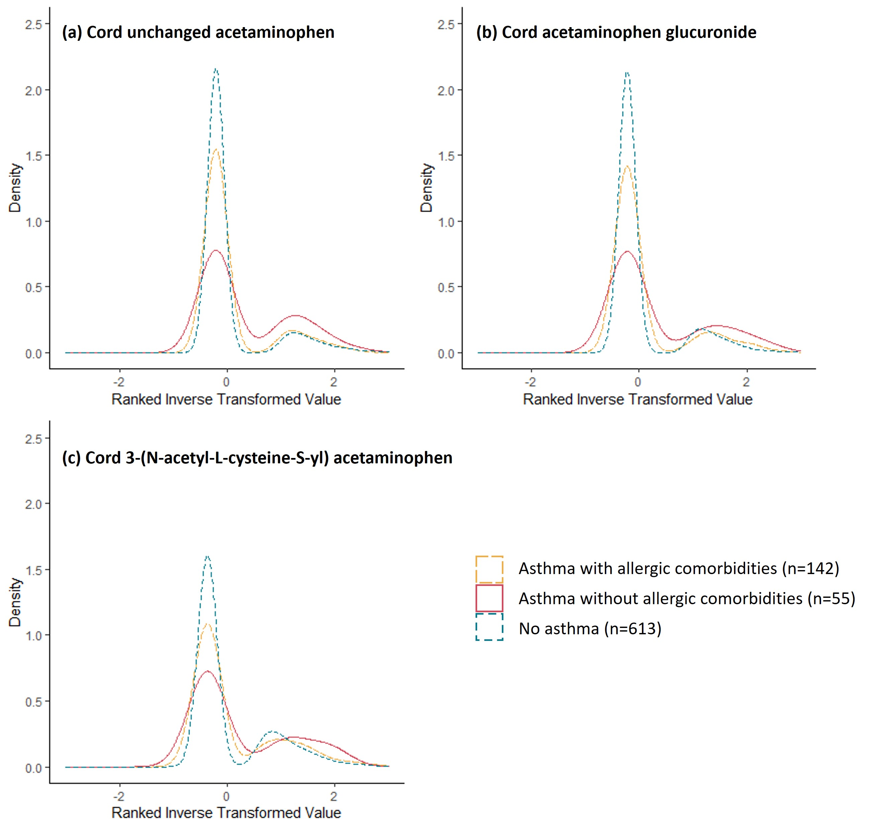

<!--more-->
Led an analysis to investigate the associations between acetaminophen metabolites (measured by liquid chromatography-mass spectrometry, LC-MS) in cord blood and *subtypes* of childhood asthma. In a birth cohort of 810 children, we found that detection of acetaminophen metabolites in cord blood was associated with an increased risk of childhood asthma *without* allergic condition (i.e., allergic rhinitis, atopic dermatitis), but was not associated with childhood asthma *with* allergic conditions.
 

 
This work resulted in a first-authored manuscript currently under reviewed by *Annals of Allergy, Asthma and Immunology*.